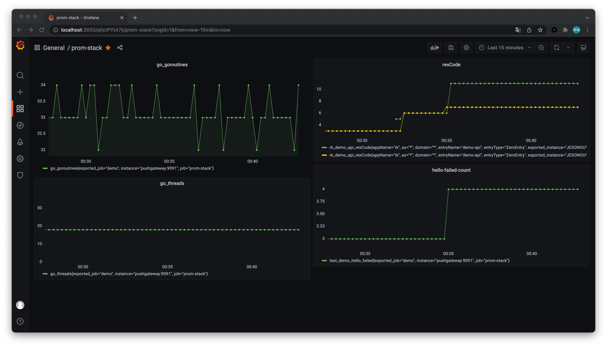

# README

## RPC

https://go-zero.dev/cn/goctl-rpc.html

## 更新API后生成代码

`goctl api go -api gozerodemo.api -dir . -style gozero`

## 启动服务

`go run gozerodemo.go -f etc/gozerodemo-api.yaml`

## 验证

```
% curl -i -X GET \
    http://localhost:8888/from/me 
HTTP/1.1 200 OK
Content-Type: application/json
Date: Tue, 07 Sep 2021 13:22:35 GMT
Content-Length: 23

{"Message":"hello: me"} 
```

## 监控

参考[使用prometheus + grafana + pushgateway搭建监控可视化系统](https://juejin.cn/post/6844903848230944776)

配置：以resCode为例 `rk_demo_api_resCode{exported_job="demo",instance="pushgateway:9091",job="prom-stack"}`



参考[一篇文章带你理解和使用Prometheus的指标](https://frezc.github.io/2019/08/03/prometheus-metrics/)

按分钟进行统计 `increase(rk_demo_api_resCode{exported_job="demo",instance="pushgateway:9091",job="prom-stack"}[1m])`