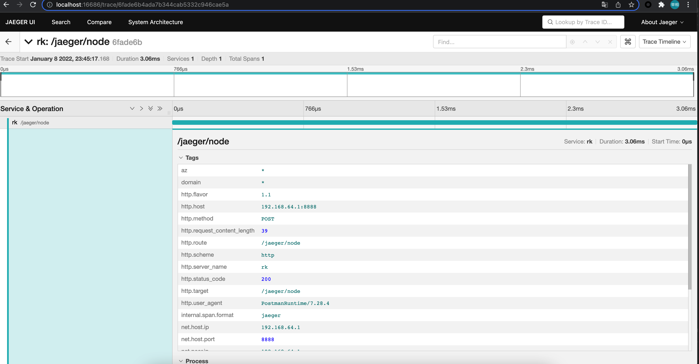

# README

## RPC

https://go-zero.dev/cn/goctl-rpc.html

## 更新API后生成代码

`goctl api go -api gozerodemo.api -dir . -style gozero`

## 启动服务

`go run gozerodemo.go -f etc/gozerodemo-api.yaml`

## 验证

```
% curl -i -X GET \
    http://localhost:8888/from/me 
HTTP/1.1 200 OK
Content-Type: application/json
Date: Tue, 07 Sep 2021 13:22:35 GMT
Content-Length: 23

{"Message":"hello: me"} 
```

## 监控

参考[使用prometheus + grafana + pushgateway搭建监控可视化系统](https://juejin.cn/post/6844903848230944776)

配置：以resCode为例 `rk_demo_api_resCode{exported_job="demo",instance="pushgateway:9091",job="prom-stack"}`


参考:

[一篇文章带你理解和使用Prometheus的指标](https://frezc.github.io/2019/08/03/prometheus-metrics/)

[容器监控实践—PromQL查询解析](https://segmentfault.com/a/1190000018372390)

按分钟进行统计 `increase(rk_demo_api_resCode{exported_job="demo",instance="pushgateway:9091",job="prom-stack"}[1m])`

grafana: http://127.0.0.1:3000/

pushGateway: http://127.0.0.1:9091/

## 分布式任务队列

https://github.com/hibiken/asynq

docker run --rm --name asynqmon -d -p 8098:8080 -e REDIS_ADDR=172.17.0.1:6379 hibiken/asynqmon

Web页面: http://127.0.0.1:8098/

## 链路追踪

```shell
# 启动jaeger
docker run -d --name jaeger \
    -e COLLECTOR_ZIPKIN_HOST_PORT=:9411 \
    -p 5775:5775/udp \
    -p 6831:6831/udp \
    -p 6832:6832/udp \
    -p 5778:5778 \
    -p 16686:16686 \
    -p 14268:14268 \
    -p 14250:14250 \
    -p 9411:9411 \
    jaegertracing/all-in-one:1.23
```

参考：https://rkdev.info/cn/docs/bootstrapper/user-guide/grpc-golang/basic/interceptor-tracing/



Web页面: http://127.0.0.1:16686/

### 部署示例APP

```shell

docker run --rm -it \
  --link jaeger \
  -p 8080-8083:8080-8083 \
  -e JAEGER_AGENT_HOST="jaeger" \
  jaegertracing/example-hotrod:1.14 \
  all
```

参考：https://blog.csdn.net/panjianlongWUHAN/article/details/113347757

## gRPC测试工具

工具地址：https://github.com/fullstorydev/grpcui

参考：https://segmentfault.com/a/1190000020954443

在rpc服务`hello`为例，在其配置中设置`Mode`为`test`或者`dev`并重启服务，然后执行`grpcui -plaintext localhost:8080`


## 接入北极星

### 安装北极星（单机版）
https://polarismesh.cn/zh/doc/%E5%BF%AB%E9%80%9F%E5%85%A5%E9%97%A8/%E5%AE%89%E8%A3%85%E6%9C%8D%E5%8A%A1%E7%AB%AF/%E5%AE%89%E8%A3%85%E5%8D%95%E6%9C%BA%E7%89%88.html#%E5%8D%95%E6%9C%BA%E7%89%88%E5%AE%89%E8%A3%85

### go-zero北极星服务发现能力支持
https://github.com/zeromicro/zero-contrib/tree/main/zrpc/registry/polaris

### 例子
服务端注册示例见：rpc/jaeger/jaeger.go

客户端调用示例见：rpc/jaeger/example/jaeger/main.go

注意调用示例同目录下需要添加`polaris.yaml`文件，内容为：
```yaml
global:
    serverConnector:
        addresses:
            - 127.0.0.1:8091
```